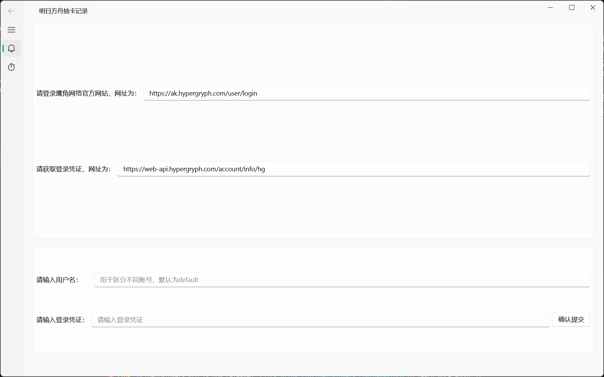

# 明日方舟寻访统计

让我先叠甲)写了一个非常非常非常简单的，明日方舟抽卡统计的程序。水平有限，可以预期的，会有很多很多很多bug

## 警告
1. 目前只有官服(我和我的狐朋狗友们没B服账号
2. 想要删除记录要手动删掉json文件
3. 数据全在本地，不会上传。数据量多起来的话，可能会卡(虽然现在也卡卡的)？也可能会出我没预料的bug
4. 做的比较简陋，估计bug也挺多的，真是抱歉
5. 多账号，用的时候一不小心各个账号的寻访记录会串...
6. 最多只能看5个池子7.
7. 只有windows能用的.exe

## 功能
1. 输入“登录凭证”爬到寻访记录，储存为本地json文件。点击左侧“寻访统计”查看。
2. 不输入“用户名”时为默认用户，输入“用户名”可以存储多个账号的寻访信息。
3. 存在本地记录时，输入“登录凭证”进行查询，新旧记录会进行合并。小心用户名输错不同账号串在一起）
4. 存在本地记录时，可以不输入“登录凭证”，直接“寻访统计”查看。可以仅输入“用户名”进行记录切换。

## 示例
1. 不输入“用户名”时，为默认用户。输入“登录凭证”，点击“确认提交”。

2. 提示“提交成功”后，点击左侧“寻访统计”，查看寻访信息。

3. 输入“用户名”与相应“登录凭证”，可以查看其他账号寻访信息。

4. 存在本地记录时，“寻访统计”页面默认显示默认用户。
5. 存在本地记录时，可以通过输入“用户名”切换账号查看。

python实现，代码都放在github上了，用了[PyQt-Fluent-Widgets](https://github.com/zhiyiYo/PyQt-Fluent-Widgets)组件库

感觉说了一堆废话)...敲代码的时候觉得还好，敲完之后觉得进行了一项毫无意义的工作。估计是没人会用啦~有bug我会考虑修的，有什么想加的功能也可以提一提，没准我就加了呢...(给我发叔叔涩图，让叔叔色诱我，我就一定改!
